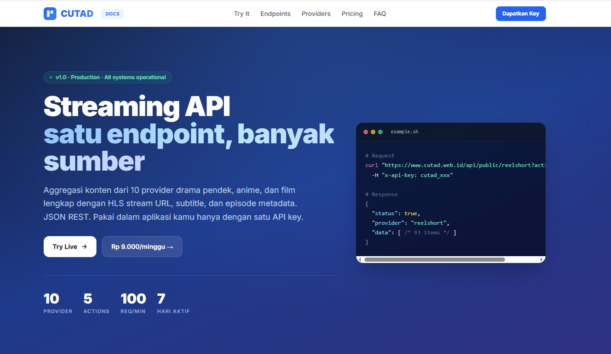

<div align="center">



# 🎬 MovieBox API — by CUTAD

**Movie, Series, K-Drama, Anime & lebih banyak lagi**

[](https://www.cutad.web.id/category/moviebox)
[](https://www.cutad.web.id/docs)
[](https://www.cutad.web.id/docs#pricing)
[](./LICENSE)

Unlock akses ke **MovieBox** dan 9 provider streaming lainnya dengan **satu API key**.
100 req/menit · 5 endpoint · HLS + subtitle · response JSON · uptime 99.9%.

[**Try Live →**](https://www.cutad.web.id/docs#try) · [**Dapatkan API Key →**](https://www.cutad.web.id/docs#pricing) · [**Semua Provider →**](https://www.cutad.web.id/docs#providers)

</div>

---

## ✨ Kenapa pakai CUTAD API?

- 🚀 **Zero scraping headache** — upstream berubah, endpoint kamu tetap jalan. Kami yang jaga.
- 🎯 **Satu endpoint, banyak sumber** — `MovieBox` + 9 provider lain tanpa ubah kode.
- 🔑 **1 API key unlock semua** — Rp 9.000 / minggu. Tidak ada quota tersembunyi.
- 📺 **HLS + subtitle native** — m3u8 ready, VTT subtitle (auto-convert dari SRT).
- ⚡ **100 req/menit** — cukup untuk app dengan ratusan user concurrent.
- 🛡️ **Uptime 99.9%** — monitoring aktif, CDN-backed.

---

## 🚀 Quickstart

### 1. Dapatkan API key
Buka [cutad.web.id/docs](https://www.cutad.web.id/docs#pricing), bayar QRIS Rp 9.000 → key langsung jadi (auto-delivery).

### 2. Panggil endpoint

**cURL:**
```bash
curl "https://www.cutad.web.id/api/public/moviebox?action=rank" \
  -H "x-api-key: cutad_YOUR_KEY_HERE"
```

**JavaScript (Node 18+):**
```js
const res = await fetch(
  "https://www.cutad.web.id/api/public/moviebox?action=rank",
  { headers: { "x-api-key": process.env.CUTAD_KEY } }
);
const { data } = await res.json();
console.log(data);
```

**Python:**
```python
import os, requests
r = requests.get(
    "https://www.cutad.web.id/api/public/moviebox",
    params={"action": "rank"},
    headers={"x-api-key": os.environ["CUTAD_KEY"]},
)
print(r.json()["data"])
```

Contoh lebih lengkap di [`examples/`](./examples).

---

## 📦 Install sebagai SDK

### JavaScript / TypeScript
```bash
# Clone repo ini atau copy file src-js/client.mjs ke project kamu
curl -o cutad-client.mjs https://raw.githubusercontent.com/rudiansyah1998/moviebox-api/main/src-js/client.mjs
```
```js
import { CutadClient } from "./cutad-client.mjs";
const client = new CutadClient(process.env.CUTAD_KEY, "moviebox");
const items = await client.rank();
```

### Python
```bash
curl -o cutad_client.py https://raw.githubusercontent.com/rudiansyah1998/moviebox-api/main/src-py/cutad_client.py
```
```python
from cutad_client import CutadClient
client = CutadClient(api_key=os.environ["CUTAD_KEY"], provider="moviebox")
items = client.rank()
```

---

## 📖 Endpoint Reference

Base URL: `https://www.cutad.web.id/api/public/moviebox`

Authentication: query `?key=xxx` **atau** header `x-api-key: xxx` (recommended — lebih aman, tidak muncul di log).

| Action    | Method | Params              | Deskripsi                                         |
|-----------|--------|---------------------|---------------------------------------------------|
| `rank`    | GET    | —                   | Konten populer / trending dari MovieBox           |
| `detail`  | GET    | `id` (required)     | Metadata lengkap (judul, sinopsis, genre, poster) |
| `episodes`| GET    | `id` (required)     | List semua episode (untuk series)                 |
| `stream`  | GET    | `id` (required)     | HLS stream URL + subtitle tracks                  |
| `search`  | GET    | `q` (required)      | Cari judul / kata kunci                           |

### Response format

**Success (200):**
```json
{
  "status": true,
  "provider": "moviebox",
  "data": [ /* array of items atau object detail */ ]
}
```

**Error:**
```json
{ "status": false, "error": "invalid key" }
```

| HTTP | Error                      | Penyebab                                 |
|------|----------------------------|------------------------------------------|
| 401  | `missing key` / `invalid key` | Key salah / tidak ada / expired       |
| 400  | `missing param`            | Parameter wajib tidak dikirim            |
| 404  | `not found`                | ID konten tidak ada                      |
| 429  | `rate limit`               | 100 req/menit terlampaui (tunggu 1 menit)|

---

## 🗂️ Struktur repo ini

```
├── README.md                 # Dokumentasi & promosi (file ini)
├── examples/
│   ├── curl.sh               # Semua 5 action via shell
│   ├── javascript.mjs        # Node 18+ fetch
│   └── python.py             # requests
├── src-js/
│   └── client.mjs            # Mini SDK CutadClient (JavaScript)
├── src-py/
│   └── cutad_client.py       # Mini SDK CutadClient (Python)
├── docs/
│   └── hero.png              # Banner image
├── package.json              # Metadata (JS)
├── pyproject.toml            # Metadata (Python)
├── .env.example              # Template environment variable
├── .gitignore
└── LICENSE                   # MIT
```

---

## 🎯 Use case

- **Aplikasi streaming kamu sendiri** — jangan scrape manual, pakai API yang stabil.
- **Aggregator / discovery** — gabungkan MovieBox dengan 9 provider lain dalam 1 dashboard.
- **Research / NLP** — dataset metadata film untuk training model (sinopsis, genre, tahun).
- **Notification bot** — Telegram / Discord bot yang auto-post drama baru.

---

## 💸 Harga & kebijakan

- **Rp 9.000 / minggu** — full akses 10 provider, 5 endpoint, 100 req/menit.
- Aktif **7 hari** dari pembayaran.
- Perpanjang anytime di [cutad.web.id/docs#extend](https://www.cutad.web.id/docs#extend).
- **Tidak ada kontrak, tidak ada subscription.** Bayar aja kalau butuh.
- Pembayaran QRIS (GoPay, OVO, DANA, ShopeePay, BCA, semua bank).

---

## ❓ FAQ

<details>
<summary><b>Apakah legal?</b></summary>
<p>API ini adalah aggregator metadata dari sumber publik. Semua konten video berasal dari provider pihak ketiga. CUTAD tidak meng-host file apapun. Silakan baca DMCA policy di <a href="https://www.cutad.web.id/dmca">cutad.web.id/dmca</a>.</p>
</details>

<details>
<summary><b>Apakah subtitle tersedia?</b></summary>
<p>Ya. Response <code>action=stream</code> mengandung field <code>subtitles[]</code> dengan URL VTT (auto-converted dari SRT upstream). Bahasa tersedia tergantung provider — MovieBox biasanya punya sub Indonesia, Inggris, dan bahasa lainnya.</p>
</details>

<details>
<summary><b>Rate limit kena? Bagaimana?</b></summary>
<p>Limit 100 req/menit per key. Kalau kena 429, tunggu 60 detik. Untuk traffic lebih tinggi, contact <a href="mailto:akunmyid@gmail.com">akunmyid@gmail.com</a>.</p>
</details>

<details>
<summary><b>Bisa dipakai untuk komersial?</b></summary>
<p>Boleh, selama tidak melanggar TOS upstream provider. Silakan baca <a href="https://www.cutad.web.id/terms">Terms of Service</a>.</p>
</details>

---

## 📞 Kontak

- 📧 Email: [akunmyid@gmail.com](mailto:akunmyid@gmail.com)
- 💬 Telegram: [@cutadweb](https://t.me/cutadweb)
- 📘 Facebook: [n00bsh0p](https://www.facebook.com/n00bsh0p/)
- 🌐 Web: [www.cutad.web.id](https://www.cutad.web.id)
- 📖 Docs: [www.cutad.web.id/docs](https://www.cutad.web.id/docs)

---

## 📜 Lisensi

Repository ini (SDK client & contoh code) di-lisensi **MIT**. Content upstream (video, metadata) milik provider masing-masing dan mengikuti TOS mereka.

<div align="center">

**Made with ❤️ in Indonesia — by [CUTADX](https://www.cutad.web.id)**

⭐ Kalau repo ini berguna, kasih star supaya teman-teman developer lain juga kebantu!

</div>
